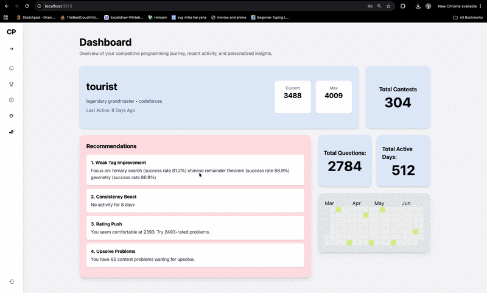
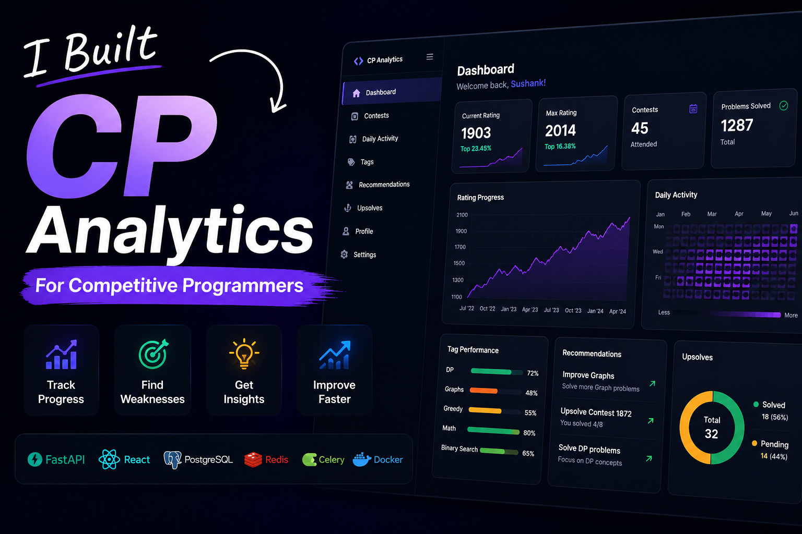
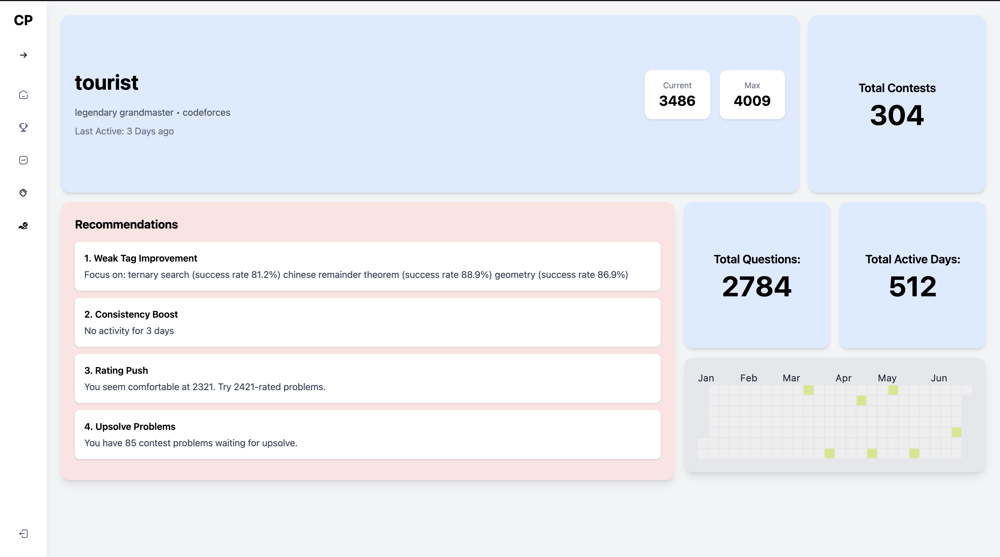
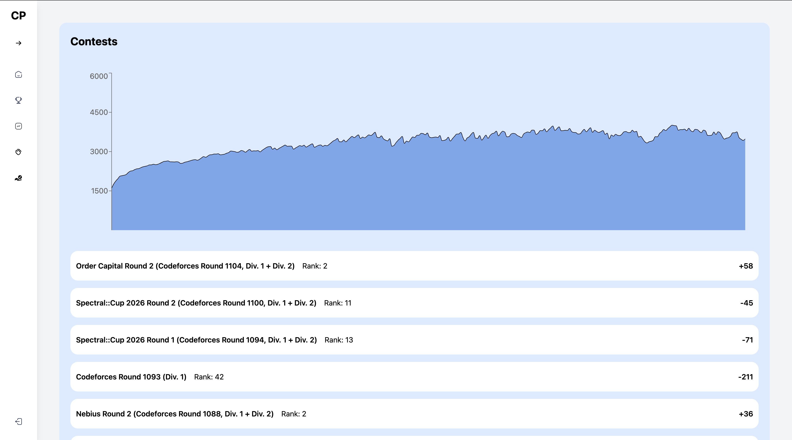
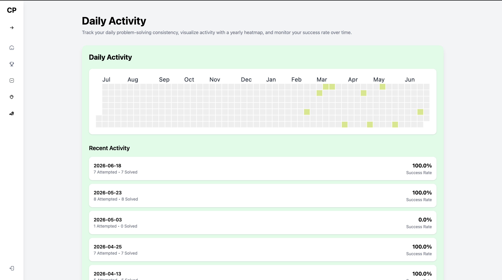
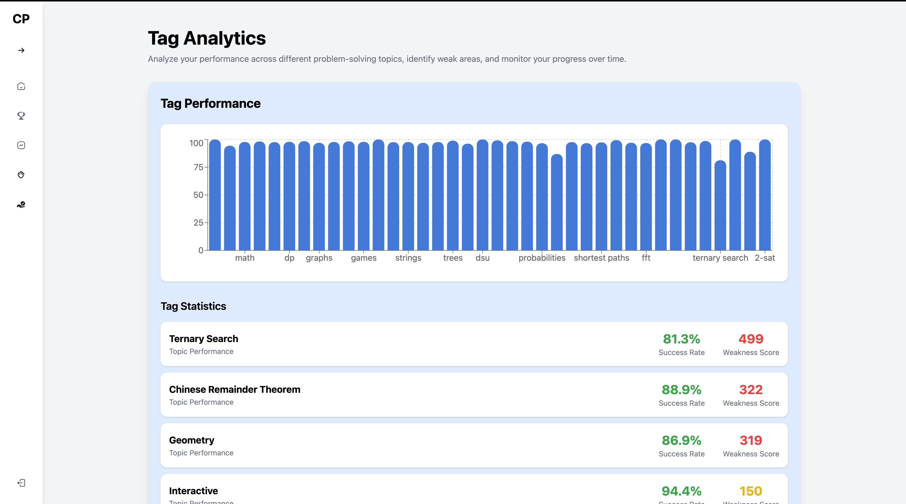
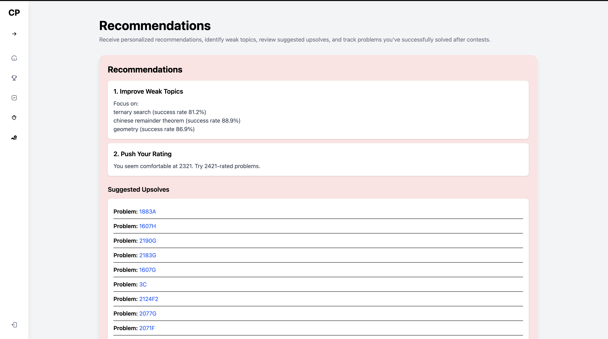
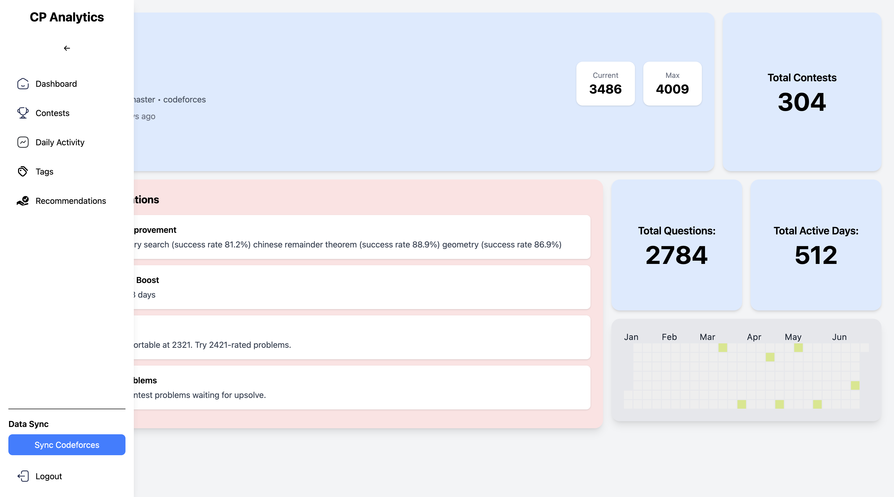

# AI-Powered Competitive Programming Analytics Platform


An end-to-end competitive programming analytics platform that synchronizes Codeforces data, analyzes user performance, identifies strengths and weaknesses, and uses machine learning to generate personalized problem recommendations and problem-level insights.

---

## Quick Preview

<p align="center">
  
</p>

<p align="center">
  <i>
    A walkthrough of CP Analytics covering authentication, Codeforces synchronization,
    analytics, contest performance, daily activity, tag analysis,
    personalized recommendations, and ML-powered problem insights.
  </i>
</p>

---

## Project Demo

<p align="center">
  <a href="https://youtu.be/SYv24VIP74I">
    
  </a>
</p>

<p align="center">
  <b>▶ Click the thumbnail to watch the complete project walkthrough.</b>
</p>

---

## Live Demo

**Frontend:**  
https://cp-bot-main.onrender.com

**Backend API:**  
https://cp-bot-1.onrender.com/docs

> **Note:** The production deployment runs synchronization synchronously because the Render free tier does not support a persistent Celery worker. The complete Celery-based background processing architecture is retained for local development.

---

# What Makes This Project Different?

CP Analytics combines **data engineering, machine learning, analytics, and full-stack deployment** into a single system.

The platform processes thousands of historical competitive programming submissions and transforms them into personalized learning recommendations.

### ML Pipeline

```text
Codeforces Submission History
            │
            ▼
      Data Cleaning
            │
            ▼
     Feature Engineering
            │
            ▼
   23 Leakage-Safe Features
            │
            ▼
 Temporal Train/Test Split
            │
            ▼
 Logistic Regression
          vs
     Random Forest
            │
            ▼
     Model Evaluation
            │
            ▼
   Trained Random Forest
            │
            ▼
   Solve Probability
            │
            ▼
 Personalized Ranking
            │
            ▼
 Recommendations + Insights
```

---

# Machine Learning

## Dataset

The ML pipeline was built using **24K+ historical Codeforces problem attempts** after data cleaning.

The raw submission data contains information such as:

- User
- Problem
- Problem rating
- Submission verdict
- Submission timestamp
- Problem tags
- Previous attempts
- Historical solving behavior

The data is transformed into a chronological user-history dataset for model training.

---

## Feature Engineering

The model uses **23 leakage-safe features** derived from historical user behavior and problem metadata.

Feature groups include:

### Problem Difficulty

- Problem rating
- Rating difference from user
- Maximum rating difference
- Average solved rating
- Maximum solved rating

### Historical Performance

- Historical solve rate
- Total attempts
- Average attempts before solving

### Topic Performance

- Tag familiarity
- Average tag success
- Strongest tag success
- Weakest tag success

### Recent Activity

- Recent 7-day solve rate
- Recent 7-day attempts
- Recent 30-day solve rate
- Recent 30-day attempts

### Failure Patterns

- Recent wrong-answer rate
- Recent TLE rate
- Recent runtime-error rate
- Recent compilation-error rate

### Problem-Specific History

- Previous attempts on the problem
- Previous failures
- Previous successful submission

All historical features are generated using information available **before the current submission**, preventing future information from leaking into training features.

---

## Model Training

Two models were evaluated:

- Logistic Regression
- Random Forest

A **temporal train/test split** was used instead of randomly shuffling submissions, making evaluation more representative of real-world prediction.

### Dataset

```text
Total cleaned records: 24,862

Training set: 19,889
Test set:       4,973
```

### Random Forest Results

| Metric | Score |
|---|---:|
| Accuracy | 0.670 |
| Precision | 0.710 |
| Recall | 0.695 |
| F1 Score | 0.702 |
| ROC-AUC | 0.722 |
| PR-AUC | 0.766 |

Random Forest was selected as the final model based on its overall performance on the held-out temporal test set.

The trained model and feature configuration are persisted and loaded during inference.

---

# Personalized Recommendation System

The recommendation engine combines:

1. User's current competitive programming rating
2. Historical solving performance
3. Weakest programming topics
4. Problem difficulty
5. ML-predicted solve probability
6. Topic familiarity
7. Recent activity
8. Previous problem-solving behavior

The system first identifies suitable unattempted problems and then uses the trained ML model to estimate the probability that the user will solve each problem.

Problems are ranked using the predicted probability and personalized topic/difficulty signals.

### Recommendation Categories

- Weak Topic Improvement
- Rating Push
- Consistency Boost
- Upsolve Recommendations
- Contest Preparation

Each recommendation can include a personalized explanation describing why the problem is relevant to the user.

---

# AI Problem Insights

The platform also provides a dedicated **AI Problem Insights** feature.

Users can enter a Codeforces problem ID such as:

```text
1537C
1794B
1490B
2026A
```

The system analyzes the problem against the user's historical performance.

### Insights include

- Problem information
- Problem rating
- Problem tags
- Predicted solve probability
- Difficulty band
- Personalized recommendation reason
- Overall solve rate
- Recent 7-day performance
- Recent 30-day performance
- Topic-level performance
- Topic familiarity
- Model signals
- Personalized insights

Example flow:

```text
User enters problem ID
          │
          ▼
Problem lookup
          │
          ▼
User history + problem metadata
          │
          ▼
Feature generation
          │
          ▼
ML prediction
          │
          ▼
Topic analysis
          │
          ▼
Personalized insights
```

---

# Analytics

## Dashboard

The dashboard provides an overview of the user's competitive programming activity, including:

- Current profile information
- Total contests
- Total problems
- Active days
- Recent activity
- Personalized recommendations

## Daily Activity

Tracks:

- Problems attempted
- Problems solved
- Daily success rate
- Activity streaks
- Yearly activity heatmap

## Contest Analytics

Analyzes:

- Rating progression
- Contest performance
- Rating trends
- Peak rating
- Contest statistics

## Tag Analytics

Provides:

- Tag-wise solve rate
- Topic performance
- Strong topics
- Weak topics
- Topic ranking
- Skill estimation

---

# Application Features

## Authentication

- JWT Authentication
- User Registration
- User Login
- Protected Routes
- Authentication-aware API requests

## Codeforces Synchronization

- Codeforces Profile Sync
- Contest History Import
- Submission History Import
- User Activity Synchronization

## Data Processing

- Submission cleaning
- Historical performance aggregation
- Topic-level statistics
- Chronological feature generation
- ML-ready dataset generation

## Machine Learning

- Feature engineering
- Binary classification
- Random Forest
- Logistic Regression baseline
- Temporal validation
- Model evaluation
- Personalized prediction
- Recommendation ranking

## Recommendations

- Personalized problem recommendations
- Weak-topic recommendations
- Difficulty-aware recommendations
- ML solve probability
- Problem-level insights

---

# System Architecture

```text
                       React Frontend
                     Vite + TailwindCSS
                            │
                            ▼
                     FastAPI Backend
                            │
             ┌──────────────┼──────────────┐
             │              │              │
             ▼              ▼              ▼
        PostgreSQL      Redis Cache    Celery Worker
             │
             ▼
       Analytics Engine
             │
             ▼
     Feature Engineering
             │
             ▼
      ML Inference Layer
             │
             ▼
     Random Forest Model
             │
             ▼
 Recommendations + Insights

             │
             ▼
       Codeforces API
```

### Production Architecture

The production deployment uses the Render environment.

Because the free-tier deployment does not provide a persistent Celery worker, synchronization falls back to synchronous execution while the complete Celery architecture remains available for local development.

---

# Tech Stack

## Data Science / Machine Learning

- Python
- Pandas
- NumPy
- Scikit-learn
- Matplotlib
- Seaborn
- Feature Engineering
- Classification
- Random Forest
- Logistic Regression
- Model Evaluation

## Backend

- FastAPI
- SQLAlchemy 2.0
- Alembic
- REST APIs
- JWT Authentication

## Database / Data Infrastructure

- PostgreSQL
- MySQL
- SQLite
- Redis
- Celery

## Frontend

- React
- Vite
- TailwindCSS
- Axios
- React Router

## DevOps / Testing

- Docker
- Docker Compose
- GitHub Actions
- Pytest
- Render

---

# Project Structure

```text
.
├── backend
│   ├── routers
│   ├── services
│   ├── tasks
│   ├── core
│   ├── models.py
│   ├── crud.py
│   └── database.py
│
├── ml
│   ├── features.py
│   ├── train.py
│   ├── models
│   │   ├── best_model.pkl
│   │   └── feature_cols.pkl
│   └── ...
│
├── frontend
│   ├── src
│   │   ├── pages
│   │   ├── components
│   │   ├── services
│   │   └── routes
│
├── docker-compose.yml
├── Dockerfile
└── README.md
```

---

# API Endpoints

## Authentication

```http
POST /auth/register
POST /auth/login
```

## Synchronization

```http
POST /sync/codeforces
GET /sync/status/{task_id}
```

## Dashboard

```http
GET /users/dashboard
```

## Analytics

```http
GET /users/contests
GET /users/daily-activity
GET /users/tags
GET /users/tags/weakest
```

## Recommendations

```http
GET /users/recommendations
GET /users/upsolve
GET /users/personalized
```

## Personalized Insights

```http
GET /users/personalized/{problem_id}/insights
```

---

# Dashboard Preview

## Dashboard



## Contest Analytics



## Daily Activity



## Tag Analytics



## Recommendations



## Sidebar Navigation



---

# Testing

The backend uses **Pytest** with a dedicated testing database.

### Authentication Tests

- Registration
- Login
- Invalid credentials
- Protected routes

### Analytics Tests

- Dashboard
- Daily activity
- Tag analytics
- Contest analytics
- Recommendations

### Infrastructure

- Pytest fixtures
- FastAPI dependency overrides
- Separate test database
- GitHub Actions CI pipeline

---

# Quick Start

The recommended way to run the complete application locally is Docker Compose.

```bash
docker compose up --build
```

This starts:

- FastAPI Backend
- PostgreSQL
- Redis
- Celery Worker
- React Frontend

---

# Manual Setup

## 1. PostgreSQL

Ensure PostgreSQL is running and the required database is available.

## 2. Redis

```bash
redis-server
```

## 3. Backend

```bash
pip install -r requirements.txt
alembic upgrade head
uvicorn main:app --reload
```

## 4. Celery Worker

```bash
celery -A core.celery_app worker --loglevel=info
```

## 5. Frontend

```bash
cd frontend
npm install
npm run dev
```

---

# Environment Variables

Create a `.env` file containing the required configuration:

```env
POSTGRES_USER=
POSTGRES_PASSWORD=
POSTGRES_DB=

DB_URL=
DB_URL_TEST=

SECRET_KEY=
ALGORITHM=HS256

REDIS_HOST=redis
REDIS_URL=redis://redis:6379/0

USE_CELERY=true
USE_REDIS=true
RUN_MIGRATIONS=false

VITE_API_URL=http://localhost:8000
```

Never commit production secrets or credentials to the repository.

---

# Deployment

The application is deployed using Render.

### Production Components

- React frontend
- FastAPI backend
- PostgreSQL database
- Redis
- Production environment configuration

The trained ML model is stored as a model artifact and loaded by the backend during inference.

The production database contains its own synchronized user data; the model does not require the training database to make predictions as long as the required features can be generated from the available user history.

---

# Learning Outcomes

This project provided hands-on experience with:

- Data Cleaning
- Exploratory Data Analysis
- Feature Engineering
- Leakage Prevention
- Temporal Train/Test Splitting
- Classification
- Model Comparison
- Model Evaluation
- Recommendation Systems
- Personalized Prediction
- Analytics Pipeline Design
- PostgreSQL
- SQLAlchemy ORM
- REST API Design
- FastAPI
- Redis Caching
- Background Processing
- Celery
- Docker
- Automated Testing
- GitHub Actions
- Production Deployment
- Full-Stack ML Integration

---

# Future Improvements

- Personalized Study Plans
- Weekly Performance Reports
- Multi-platform support for LeetCode, CodeChef, and AtCoder
- Real-time notifications
- WebSocket-based live updates
- Monitoring and metrics dashboard
- OpenTelemetry integration

---

# License

This project is licensed under the MIT License.

---

# Author

## Sushank Singh

B.Tech. Computer Science and Engineering  
VIT-AP University

**GitHub:** https://github.com/sushanksingh00

**LinkedIn:** https://www.linkedin.com/in/sushank-singh-92a80731a/
